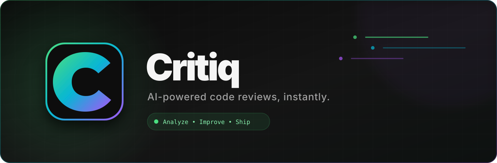

<div align="center">
  

  <br />

  [](https://critiq-ai-code-reviewer.vercel.app/)
  
  
  

  **Paste code. Find problems. Ship better software.**
</div>

## What is Critiq?

Critiq is a responsive AI code-review workspace that analyzes **JavaScript, Python, Java, C++, and React**. It turns pasted code into a structured report containing an overall score, bugs, security concerns, performance suggestions, quality improvements, complexity, best-practice checks, and refactored code.

### Highlights

| | Feature | What it does |
|---|---|---|
| ⚡ | AI analysis | Generates structured reviews through Google Gemini |
| 🧠 | Detailed reports | Scores bugs, security, performance, quality, and complexity |
| ✨ | Refactoring | Produces an improved, copy-ready version of the submitted code |
| 🔐 | Private accounts | Firebase Authentication keeps each user session separate |
| 🗂️ | Review history | Saves, opens, copies, and deletes reports from Firestore |
| 📱 | Responsive UI | Charcoal interface designed for mobile, tablet, and desktop |

## Built with

- **Next.js 16** and **React 19**
- **Tailwind CSS 4**
- **Google Gemini API** through a protected server route
- **Firebase Authentication** and **Cloud Firestore**
- **Vercel** for deployment

## Run locally

```bash
git clone <your-repository-url>
cd critiq-ai-code-reviewer
npm install
```

Create `.env.local` in the project root:

```env
GEMINI_API_KEY=
GITHUB_TOKEN=
NEXT_PUBLIC_FIREBASE_API_KEY=
NEXT_PUBLIC_FIREBASE_AUTH_DOMAIN=
NEXT_PUBLIC_FIREBASE_PROJECT_ID=
```

Then start the development server:

```bash
npm run dev
```

Open [http://localhost:3000](http://localhost:3000).

## Firebase setup

1. Enable **Email/Password** authentication in Firebase.
2. Create a Cloud Firestore database.
3. Add `localhost` and your production hostname to Authentication → Authorized domains.
4. Deploy the included owner-only rules:

```bash
npx firebase-tools login
npx firebase-tools deploy --only firestore:rules --project YOUR_PROJECT_ID
```

## Security

- The Gemini key is server-only and must **never** use the `NEXT_PUBLIC_` prefix.
- `/api/analyze` requires a valid Firebase token and applies origin checks, input limits, timeouts, and user/IP rate limits.
- Firestore rules restrict review access to the authenticated owner.
- `.env.local` is excluded from Git.

## Scripts

```bash
npm run dev      # Development server
npm run build    # Production build
npm run start    # Start production server
npm run lint     # ESLint checks
```

<div align="center">
  <br />
  <strong>Built for developers who want useful feedback without the noise.</strong>
  <br /><br />
  <a href="https://critiq-ai-code-reviewer.vercel.app/">Launch Critiq →</a>
</div>
