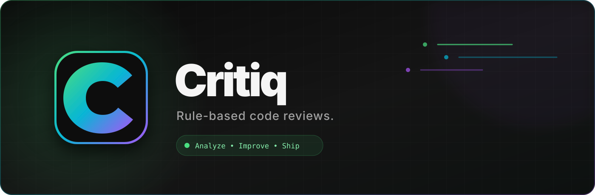

<div align="center">
  

  <br />

  [](https://critiq-ai-code-reviewer.vercel.app/)
  
  
  

  **Paste code. Find problems. Ship better software.**
</div>

## What is Critiq?

Critiq is a static code-review workspace. **JavaScript and React** use parser-based ESLint rules. **Python** uses Ruff's parser, lint/security rules and formatter through a pinned WebAssembly package. **Java and C++** use Tree-sitter structural checks; Java also supports token-checked Prettier formatting. These checks do not compile your project or replace PMD/SpotBugs/Cppcheck. Active review routes make no AI calls. Reports include rule-based scores, findings, heuristic complexity and conservative automatic fixes where supported.

Quick repository reviews sample up to 20 prioritized files. Optional **background scans** use Inngest and Firestore for commit-pinned, resumable jobs with progress, cancellation and paginated reports (up to 5,000 files / 25 MB). They require server-side setup; see [background scan deployment](docs/background-scans.md) and [analysis coverage](docs/static-analysis.md).

### Highlights

| | Feature | What it does |
|---|---|---|
| ⚡ | Static analysis | Generates repeatable findings without depending on an AI request |
| 🧠 | Detailed reports | Scores bugs, security, performance, quality, and complexity |
| ✨ | Refactoring | Applies vetted fixes for all five language choices, then rechecks the output; C++ fixes only redundant standalone semicolons |
| 🔐 | Private accounts | Firebase Authentication keeps each user session separate |
| 🗂️ | Review history | Saves, opens, copies, and deletes reports from Firestore |
| 📱 | Responsive UI | Charcoal interface designed for mobile, tablet, and desktop |

## Built with

- **Next.js 16** and **React 19**
- **Tailwind CSS 4**
- **ESLint** and React/Hooks rule plugins (no AI required)
- **Ruff 0.16.8** for Python (no Python installation or subprocess required)
- **Tree-sitter 0.27.0** and **Prettier Java 2.11.0** for Java syntax checks and formatting (no JDK required)
- **tree-sitter-cpp 0.23.4** WASM grammar for C++ structural checks (no compiler or native binding required)
- **Firebase Authentication** and **Cloud Firestore**
- **Vercel** for deployment

## Run locally

```bash
git clone <your-repository-url>
cd critiq-ai-code-reviewer
npm install
```

Create `.env.local` in the project root:

```env
GITHUB_TOKEN=
NEXT_PUBLIC_FIREBASE_API_KEY=
NEXT_PUBLIC_FIREBASE_AUTH_DOMAIN=
NEXT_PUBLIC_FIREBASE_PROJECT_ID=
```

Then start the development server:

```bash
npm run dev
```

Open [http://localhost:3000](http://localhost:3000).

## Firebase setup

1. Enable **Email/Password** authentication in Firebase.
2. Create a Cloud Firestore database.
3. Add `localhost` and your production hostname to Authentication → Authorized domains.
4. Deploy the included owner-only rules:

```bash
npx firebase-tools login
npx firebase-tools deploy --only firestore:rules --project YOUR_PROJECT_ID
```

## Security

- GitHub tokens are server-only and must **never** use the `NEXT_PUBLIC_` prefix. AI keys are not used by active review routes.
- `/api/analyze` requires a valid Firebase token and applies origin checks, input limits, timeouts, and user/IP rate limits.
- Firestore rules restrict review access to the authenticated owner.
- `.env.local` is excluded from Git.

## Scripts

```bash
npm run dev      # Development server
npm run build    # Production build
npm run start    # Start production server
npm run lint     # ESLint checks
npm test         # Analysis/refactoring regression tests
```

<div align="center">
  <br />
  <strong>Built for developers who want useful feedback without the noise.</strong>
  <br /><br />
  <a href="https://critiq-ai-code-reviewer.vercel.app/">Launch Critiq →</a>
</div>
